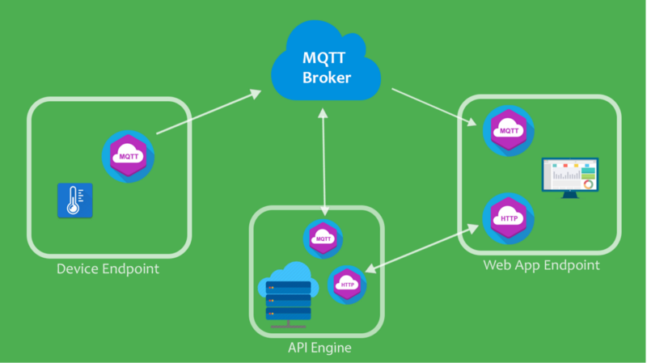

# Database Structure

## Telemetry
The sensor values will be collected and sent in a payload to the cloud in a json document:
```json
{
    "T": 30.0,
    "H": 45.0,
    "L": 78.0
}
```
At this point in time we do not have alot of data to be publishing.

## Cloud Services
Here are 2 conventional approaches to IoT architectures:


This solution emphasizes more computational load to the IoT device since it has to be an MQTT and HTTP client making 2 requests on every publish



This solution emphasizes more computational load to the backend since on every delta it has to publish to the api to store in the database.

Both of these solutions are great since they can be scaled to any size system. This can be very complicated to implement for prototyping however.

### Firebase Real-time Database

Firebase has a backend which combines HTTP and MQTT processes into a single cloud platform. When data is pushed to a firebase RTD the data is automatically timestamped and the remaining subscribed devices are updated automatically while the data is being stored into the database. This makes it very easy to prototype IoT solutions without the need for a complicated backend solution.